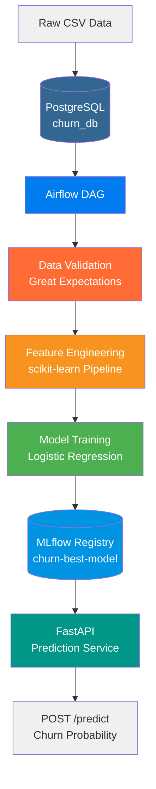
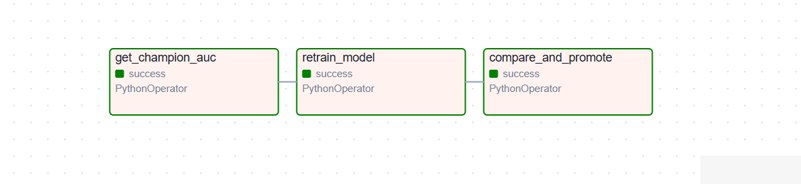
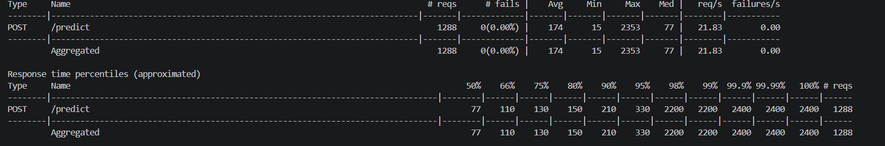

# Churn Prediction Pipeline

An end-to-end ML pipeline to predict customer churn.

## Architecture



## Setup 
'''bash
python -m venv venv
source venv/Scripts/activate
pip install -r requirements.txt
'''
## Pipeline


## Automated Retraining Pipeline

The retraining DAG (`dags/retrain_dag.py`) runs on a weekly schedule and implements the **champion/challenger pattern**:

1. `get_champion_auc` — queries MLflow registry for the current production model AUC
2. `retrain_model` — trains a fresh model on the full dataset
3. `compare_and_promote` — promotes the new model only if it outperforms the champion

All retraining runs are tagged in MLflow with `champion_auc`, `challenger_auc`, and `promotion_decision` for full audit trail.



## REST API

### Start the API server
```bash
        MLFLOW_TRACKING_URI=file:///path/to/your/mlruns python -m uvicorn src.api.main:app --reload
```

API runs at: http://127.0.0.1:8000  
Interactive docs: http://127.0.0.1:8000/docs

### Endpoints

- `GET /health` — returns model status
- `POST /predict` — returns churn probability for a customer

### Example request

```json
{
  "tenure": 2,
  "MonthlyCharges": 85.0,
  "SeniorCitizen": 0,
  "gender": "Male",
  "Partner": "No",
  "Dependents": "No",
  "PhoneService": "Yes",
  "MultipleLines": "No",
  "InternetService": "Fiber optic",
  "OnlineSecurity": "No",
  "OnlineBackup": "No",
  "DeviceProtection": "No",
  "TechSupport": "No",
  "StreamingTV": "No",
  "StreamingMovies": "No",
  "Contract": "Month-to-month",
  "PaperlessBilling": "Yes",
  "PaymentMethod": "Electronic check"
}
```
### Example response

```json
{
  "churn_probability": 0.6366,
  "prediction": "High Risk"
}
```
## Load Testing Results

Load tested the `/predict` endpoint using Locust with 50 concurrent users over 60 seconds.

**Test configuration:**
- Tool: Locust 2.44.4
- Users: 50 concurrent
- Spawn rate: 5 users/second
- Duration: 60 seconds
- Target: `http://localhost:8000/predict`

**Results:**

| Metric | Value |
|---|---|
| Total Requests | 1,288 |
| Failure Rate | 0% |
| Requests Per Second | 21.83 |
| Median Latency (p50) | 77ms |
| p75 Latency | 130ms |
| p95 Latency | 330ms |
| p99 Latency | 2,200ms |
| Min Latency | 15ms |
| Max Latency | 2,400ms |

**Analysis:** The API handles 50 concurrent users with zero failures at ~22 RPS. Median latency of 77ms reflects scikit-learn pipeline inference time. The p99 spike to 2,200ms is expected tail latency under load — requests queuing when the thread pool is fully occupied during peak concurrency.



## Running the Full Stack

All services (FastAPI, MLflow, Airflow, PostgreSQL, Redis) are orchestrated with Docker Compose.

### Prerequisites

- Docker Desktop running with WSL2 backend
- At least 4GB of memory allocated to Docker

### Start everything

```bash
docker-compose up --build
```

On first run this builds the FastAPI image and pulls all required images. Subsequent runs are faster:

```bash
docker-compose up
```

### Services

| Service | URL | Description |
|---|---|---|
| FastAPI | http://localhost:8000 | Churn prediction API |
| MLflow | http://localhost:5000 | Experiment tracking and model registry |
| Airflow | http://localhost:8080 | Pipeline orchestration (admin/admin) |

### Verify the API is running

```bash
curl http://127.0.0.1:8000/health
```

Expected response:

```json
{"status":"ok","model":"churn-best-model","stage":"Production"}
```

### Stop everything

```bash
docker-compose down
```

To also remove volumes (resets all data):

```bash
docker-compose down -v
```

## Docker Image

The FastAPI prediction API is automatically built and pushed to Docker Hub on every merge to main.

**Image:** `khushbakht91/churn-api`

Pull and run the latest image:

```bash
docker pull khushbakht91/churn-api:latest
docker run -p 8000:8000 khushbakht91/churn-api:latest
```